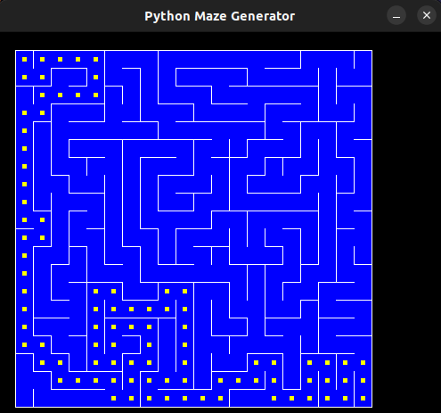

# Maze Generator

**Conteúdo da Disciplina**: Grafos 1<br>

## Alunos
|Matrícula | Aluno |
| -- | -- |
| 17/0101711  |  Daniel Barcelos Moreira |

## Sobre 
Demonstra a travessia de um labirinto utilizando o algoritmo DFS.

## Screenshots

</figcaption>
    Imagem 1: Geração do labirinto
</figcaption>


</figcaption>
    Imagem 2: Backtracking em verde
</figcaption>


</figcaption>
    Imagem 3: Menor trajeto
</figcaption>


## Instalação 
**Linguagem**: Python<br>
**Framework**: Pygame<br>
Descreva os pré-requisitos para rodar o seu projeto e os comandos necessários.

## Uso

- Instale o [python 3](https://www.python.org/downloads/);
- Instale o [pygame](https://pygame-zero.readthedocs.io/en/1.1/installation.html);

```
python3 main.py
```


## Outros 
Referência do projeto [Link](https://www.youtube.com/watch?v=Xthh4SEMA2o&t=650s)


